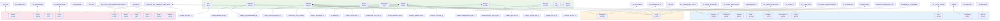

```mermaid
flowchart BT
    subgraph L0["Foundations"]
        import_fmt["import:fmt<br/>A:58 E:0"]
        import_github_com_charmbracelet_bubbletea["bubbletea<br/>A:52 E:0"]
        import_os["import:os<br/>A:42 E:0"]
        import_github_com_charmbracelet_lipgloss["lipgloss<br/>A:30 E:0"]
        import_time["import:time<br/>A:25 E:0"]
        import_strings["import:strings<br/>A:21 E:0"]
        import_log["import:log<br/>A:17 E:0"]
        import_io["import:io<br/>A:16 E:0"]
        import_github_com_charmbracelet_bubbles_key["key<br/>A:8 E:0"]
        import_math_rand["rand<br/>A:8 E:0"]
    end
    subgraph L1["Core"]
        standard_renderer_go["standard_ren...<br/>A:0 E:55"]
        tea_go["tea.go<br/>A:0 E:53"]
    end
    subgraph L2["Support"]
        screen_go["screen.go<br/>A:0 E:32"]
        nil_renderer_go["nil_renderer.go<br/>A:0 E:26"]
        options_go["options.go<br/>A:0 E:21"]
        key_go["key.go<br/>A:0 E:18"]
        inputreader_windows_go["inputreader_...<br/>A:0 E:16"]
        key_windows_go["key_windows.go<br/>A:0 E:14"]
        exec_go["exec.go<br/>A:0 E:14"]
        tty_go["tty.go<br/>A:0 E:14"]
        commands_go["commands.go<br/>A:0 E:13"]
        mouse_go["mouse.go<br/>A:0 E:12"]
    end
    subgraph L3["Applications"]
        examples_views_main_go["main.go<br/>A:0 E:19"]
        examples_autocomplete_main_go["main.go<br/>A:0 E:18"]
        examples_cellbuffer_main_go["main.go<br/>A:0 E:17"]
        examples_composable_views_main_go["main.go<br/>A:0 E:16"]
        examples_tui_daemon_combo_main_go["main.go<br/>A:0 E:15"]
        examples_progress_download_main_go["main.go<br/>A:0 E:13"]
        examples_list_simple_main_go["main.go<br/>A:0 E:12"]
        examples_credit_card_form_main_go["main.go<br/>A:0 E:12"]
        examples_glamour_main_go["main.go<br/>A:0 E:12"]
        examples_send_msg_main_go["main.go<br/>A:0 E:11"]
    end

    examples_eyes_main_go --> import_math_rand
    tutorials_commands_main_go --> import_time
    examples_autocomplete_main_go --> main_gotReposErrMsg
    tea_go --> tea__Program_Printf
    exec_go --> import_os
    examples_progress_download_tui_go --> import_strings
    examples_altscreen_toggle_main_go --> import_fmt
    examples_progress_download_main_go --> import_github_com_charmbracelet_bubbles_progress
    examples_split_editors_main_go --> import_github_com_charmbracelet_bubbletea
    examples_textarea_main_go --> import_github_com_charmbracelet_bubbletea
    tea_go --> tea__Program_Kill
    tty_windows_go --> import_os
    examples_progress_download_main_go --> import_flag
    examples_progress_download_tui_go --> import_time
    examples_spinners_main_go --> import_fmt
    examples_table_resize_main_go --> import_fmt
    inputreader_windows_go --> import_golang_org_x_sys_windows
    screen_go --> tea_hideCursorMsg
    tea_go --> tea__Program_ReleaseTerminal
    examples_sequence_main_go --> import_fmt
    examples_tui_daemon_combo_main_go --> import_github_com_charmbracelet_bubbles_spinner
    examples_stopwatch_main_go --> import_time
    examples_textarea_main_go --> import_fmt
    examples_views_main_go --> main_updateChoices
    mouse_go --> tea_MouseAction
    examples_simple_main_go --> import_github_com_charmbracelet_bubbletea
    tea_go --> tea_startupOptions_has
    tty_go --> tea__Program_readLoop
    examples_package_manager_main_go --> import_github_com_charmbracelet_bubbles_spinner
    examples_eyes_main_go --> main_tickCmd
    standard_renderer_go --> tea__standardRenderer_execute
    standard_renderer_go --> tea_Println
    tea_go --> tea__Program_RestoreTerminal
    tea_go --> tea__Program_execBatchMsg
    examples_progress_static_main_go --> import_github_com_charmbracelet_bubbletea
    examples_views_main_go --> import_math
    examples_composable_views_main_go --> main_mainModel_Update
    examples_progress_download_main_go --> main_getResponse
    tea_go --> import_io
    commands_go --> tea_sequenceMsg
    standard_renderer_go --> tea__standardRenderer_kill
    examples_pager_main_go --> import_fmt
    examples_paginator_main_go --> import_github_com_charmbracelet_bubbletea
    screen_go --> tea_showCursorMsg
    examples_pipe_main_go --> import_strings
    commands_go --> tea_Batch
    screen_go --> tea__Program_EnableMouseCellMotion
    standard_renderer_go --> tea_ClearScrollArea
    examples_http_main_go --> import_log
    key_go --> tea_unknownCSISequenceMsg_String

    style L0 fill:#e8f5e9
    style L1 fill:#fff3e0
    style L2 fill:#e3f2fd
    style L3 fill:#fce4ec
```
