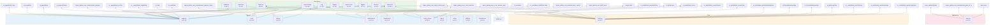

```mermaid
flowchart BT
    subgraph L0["Foundations"]
        import_fmt["import:fmt<br/>A:13 E:0"]
        import_strings["import:strings<br/>A:10 E:0"]
        import_os["import:os<br/>A:8 E:0"]
        import_path_filepath["filepath<br/>A:7 E:0"]
        import_github_com_charmbracelet_log["log<br/>A:7 E:0"]
        import_github_com_charmbracelet_lipgloss["lipgloss<br/>A:7 E:0"]
        import_errors["import:errors<br/>A:5 E:0"]
        import_time["import:time<br/>A:4 E:0"]
        import_io["import:io<br/>A:4 E:0"]
        import_github_com_charmbracelet_bubbletea["bubbletea<br/>A:4 E:0"]
    end
    subgraph L1["Core"]
        ui_stash_go["stash.go<br/>A:0 E:57"]
    end
    subgraph L2["Support"]
        ui_pager_go["pager.go<br/>A:0 E:38"]
        ui_ui_go["ui.go<br/>A:0 E:35"]
        utils_utils_go["utils.go<br/>A:0 E:15"]
        ui_markdown_go["markdown.go<br/>A:0 E:14"]
        ui_stashhelp_go["stashhelp.go<br/>A:0 E:14"]
        config_cmd_go["config_cmd.go<br/>A:0 E:10"]
        log_go["log.go<br/>A:0 E:8"]
        url_go["url.go<br/>A:0 E:8"]
        gitlab_go["gitlab.go<br/>A:0 E:8"]
        ui_stashitem_go["stashitem.go<br/>A:0 E:8"]
    end
    subgraph L3["Applications"]
        main_go["main.go<br/>A:0 E:32"]
    end

    ui_markdown_go --> ui__markdown_buildFilterValue
    ui_pager_go --> ui__pagerModel_toggleHelp
    config_cmd_go --> import_path
    github_go --> import_fmt
    ui_ui_go --> import_strings
    utils_utils_go --> import_path_filepath
    ui_markdown_go --> ui_normalize
    ui_stash_go --> ui__stashModel_updatePagination
    ui_pager_go --> import_github_com_charmbracelet_lipgloss
    ui_stash_go --> ui_stashModel_markdownIndex
    ui_stash_go --> ui__stashModel_resetFiltering
    ui_stash_go --> ui_glowLogoView
    ui_ui_go --> ui_newModel
    ui_stash_go --> ui_fetchedMarkdownMsg
    ui_stash_go --> ui_filteredMarkdownMsg
    ui_stash_go --> ui_stashModel_getVisibleMarkdowns
    config_cmd_go --> import_fmt
    ui_pager_go --> ui__pagerModel_setSize
    ui_ui_go --> import_time
    ui_stash_go --> import_fmt
    ui_stash_go --> import_github_com_charmbracelet_lipgloss
    ui_markdown_go --> import_golang_org_x_text_unicode_norm
    ui_pager_go --> import_github_com_charmbracelet_glamour
    config_cmd_go --> import_github_com_spf13_viper
    ui_pager_go --> import_github_com_charmbracelet_bubbletea
    ui_pager_go --> import_github_com_muesli_reflow_ansi
    ui_stashhelp_go --> import_strings
    ui_ui_go --> import_os
    ui_stash_go --> ui_stashModel_headerView
    config_cmd_go --> import_os
    ui_pager_go --> ui_glamourRender
    ui_markdown_go --> import_golang_org_x_text_transform
    ui_pager_go --> import_strings
    ui_stash_go --> import_github_com_muesli_reflow_ansi
    config_cmd_go --> import_github_com_charmbracelet_x_editor
    utils_utils_go --> import_github_com_charmbracelet_glamour_styles
    main_go --> main_main
    ui_stash_go --> ui_stashModel_currentSection
    github_go --> import_strings
    ui_pager_go --> import_fmt
    main_go --> import_github_com_charmbracelet_glow_v2_ui
    utils_utils_go --> import_strings
    ui_pager_go --> ui_pagerModel
    main_go --> main_validateOptions
    ui_stash_go --> ui_stashModel_cursor
    ui_ui_go --> ui_state
    ui_pager_go --> ui_reloadMsg
    ui_pager_go --> ui_pagerModel_View
    ui_stash_go --> ui_initSections
    ui_stash_go --> ui_stashModel_populatedView

    style L0 fill:#e8f5e9
    style L1 fill:#fff3e0
    style L2 fill:#e3f2fd
    style L3 fill:#fce4ec
```
