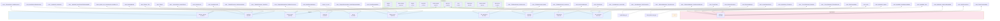

```mermaid
flowchart BT
    subgraph L0["Foundations"]
        import_os["import:os<br/>A:10 E:0"]
        import_strings["import:strings<br/>A:10 E:0"]
        import_path_filepath["filepath<br/>A:7 E:0"]
        import_fmt["import:fmt<br/>A:7 E:0"]
        import_github_com_charmbracelet_lipgloss["lipgloss<br/>A:5 E:0"]
        import_encoding_json["json<br/>A:4 E:0"]
        import_time["import:time<br/>A:4 E:0"]
        import_sync["import:sync<br/>A:4 E:0"]
        import_context["import:context<br/>A:2 E:0"]
        import_regexp["import:regexp<br/>A:2 E:0"]
    end
    subgraph L2["Support"]
        glamour_impl_go["glamour_impl.go<br/>A:0 E:30"]
        model_go["model.go<br/>A:0 E:27"]
        context_panel_go["context_pane...<br/>A:0 E:26"]
        search_go["search.go<br/>A:0 E:23"]
        toc_go["toc.go<br/>A:0 E:22"]
        ripgrep_executor_go["ripgrep_exec...<br/>A:0 E:22"]
        file_watcher_go["file_watcher.go<br/>A:0 E:21"]
        colors_go["colors.go<br/>A:0 E:21"]
        clipboard_go["clipboard.go<br/>A:0 E:19"]
        test_mocks_go["test_mocks.go<br/>A:0 E:16"]
    end
    subgraph L3["Applications"]
        main_go["main.go<br/>A:0 E:40"]
    end

    context_panel_go --> main_FileInfo
    colors_go --> main_NewColorManager
    model_go --> main__AppModel_navigateUp
    colors_go --> main_ColorPalette
    keybindings_go --> main_createDefaultConfig
    main_go --> main_FileChangedMsg
    main_go --> main_main
    ripgrep_executor_go --> main__RipgrepManagerImpl_SetMaxConcurrent
    test_mocks_go --> import_os
    colors_go --> main__ColorManager_saveConfig
    model_go --> main__AppModel_jumpToNextFileStartingWith
    search_go --> main_QuickSearch
    keybindings_go --> main_KeyBindings_FindAction
    model_go --> import_github_com_charmbracelet_bubbles_list
    search_go --> import_os
    test_mocks_go --> main_FuzzyFinder
    glamour_impl_go --> main__ElementStyle_GetBackground
    model_go --> main_NewAppModel
    test_mocks_go --> main_GlamourRenderer
    main_go --> main_AppModel_Update
    model_go --> main_FileItem_Title
    file_watcher_go --> main__FileWatcherImpl_SetRecursive
    file_watcher_go --> main__FileWatcherImpl_Watch
    main_go --> main_AppModel_handleNormalMode
    ripgrep_executor_go --> main_NewRipgrepManager
    toc_go --> main__TableOfContents_GetSelectedIndex
    colors_go --> import_os
    file_watcher_go --> main__FileWatcherImpl_eventLoop
    main_go --> main_AppModel_View
    clipboard_go --> main__ClipboardManager_CopySelection
    context_panel_go --> import_path_filepath
    glamour_impl_go --> import_github_com_charmbracelet_lipgloss
    main_go --> import_time
    main_go --> main_AppModel_renderLoadingModal
    toc_go --> main__TableOfContents_SelectFirst
    ripgrep_executor_go --> import_os_exec
    test_mocks_go --> import_encoding_json
    colors_go --> main__ColorManager_PrintThemeInfo
    context_panel_go --> main__ContextPanel_renderFileInfo
    ripgrep_executor_go --> main__RipgrepExecutorImpl_checkRipgrepAvailable
    search_go --> main_shouldIgnoreDir
    test_mocks_go --> main_RipgrepManager
    fuzzy_finder_impl_go --> main__FuzzyFinderImpl_SetMode
    glamour_impl_go --> main_NewGlamourRendererImpl
    main_go --> main_dragTimeoutCmd
    ripgrep_executor_go --> main_ParseRipgrepMatch
    context_panel_go --> import_regexp
    clipboard_go --> main__ClipboardManager_GetSelectionBounds
    fuzzy_finder_impl_go --> main__FuzzyFinderImpl_FilteredResults
    main_go --> main_FinderCanceledMsg

    style L0 fill:#e8f5e9
    style L1 fill:#fff3e0
    style L2 fill:#e3f2fd
    style L3 fill:#fce4ec
```
