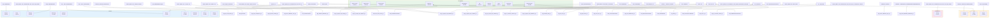

```mermaid
flowchart BT
    subgraph L0["Foundations"]
        import_context["import:context<br/>A:78 E:0"]
        import_fmt["import:fmt<br/>A:63 E:0"]
        import_strings["import:strings<br/>A:54 E:0"]
        backend_FromContext["backend.From...<br/>A:51 E:0"]
        db_WrapError["db.WrapError<br/>A:49 E:0"]
        import_github_com_charmbracelet_soft_serve_pkg_db["db<br/>A:45 E:0"]
        import_github_com_charmbracelet_soft_serve_pkg_backend["backend<br/>A:44 E:0"]
        import_github_com_charmbracelet_soft_serve_pkg_proto["proto<br/>A:41 E:0"]
        import_time["import:time<br/>A:41 E:0"]
        import_errors["import:errors<br/>A:40 E:0"]
    end
    subgraph L1["Core"]
        pkg_backend_repo_go["repo.go<br/>A:0 E:52"]
        pkg_web_git_go["git.go<br/>A:0 E:51"]
        pkg_ui_pages_repo_log_go["log.go<br/>A:0 E:44"]
    end
    subgraph L2["Support"]
        pkg_ui_pages_repo_repo_go["repo.go<br/>A:0 E:40"]
        pkg_git_lfs_go["lfs.go<br/>A:0 E:39"]
        pkg_config_config_go["config.go<br/>A:0 E:39"]
        pkg_ui_components_selector_selector_go["selector.go<br/>A:0 E:39"]
        pkg_web_git_lfs_go["git_lfs.go<br/>A:0 E:37"]
        pkg_ui_pages_repo_files_go["files.go<br/>A:0 E:37"]
        pkg_backend_user_go["user.go<br/>A:0 E:33"]
        cmd_soft_browse_browse_go["browse.go<br/>A:0 E:32"]
        pkg_ui_pages_selection_item_go["item.go<br/>A:0 E:30"]
        pkg_ui_pages_repo_stash_go["stash.go<br/>A:0 E:29"]
    end
    subgraph L3["Applications"]
        cmd_soft_main_go["main.go<br/>A:0 E:21"]
    end

    pkg_ssh_cmd_token_go --> import_github_com_caarlos0_duration
    web_parseJWT --> config_FromContext
    pkg_sync_workqueue_go --> sync_WithWorkPoolLogger
    pkg_lfs_basic_transfer_go --> import_bytes
    pkg_store_database_user_go --> import_golang_org_x_crypto_ssh
    cmd_createCommand --> config_FromContext
    pkg_backend_user_go --> backend__Backend_SetPassword
    pkg_backend_webhooks_go --> import_github_com_google_uuid
    pkg_ui_pages_repo_empty_go --> import_fmt
    pkg_ui_pages_repo_logitem_go --> repo_LogItem_FilterValue
    cmd_soft_serve_serve_go --> import_strconv
    cmd_collabListCommand --> backend_FromContext
    cmd_createCommand --> proto_UserFromContext
    pkg_ui_pages_repo_filesitem_go --> import_io_fs
    pkg_ui_pages_repo_readme_go --> repo_NewReadme
    pkg_ui_pages_repo_refsitem_go --> repo_RefItems_Len
    pkg_ui_common_common_go --> common__Common_SetValue
    pkg_ui_pages_repo_stashitem_go --> repo_StashItem
    pkg_sshutils_utils_go --> import_bytes
    pkg_ssh_ssh_go --> import_net
    pkg_db_errors_go --> db_WrapError
    pkg_ui_pages_repo_files_go --> repo__Files_StatusBarValue
    cmd_soft_main_go --> import_github_com_charmbracelet_soft_serve_cmd_soft_admin
    pkg_ssh_ssh_go --> import_strconv
    pkg_cron_cron_go --> cron_Scheduler
    pkg_config_config_go --> import_github_com_charmbracelet_soft_serve_pkg_sshutils
    web_serviceLfsLocksGet --> proto_RepositoryFromContext
    pkg_ui_pages_repo_files_go --> import_errors
    pkg_ui_pages_repo_filesitem_go --> import_github_com_charmbracelet_soft_serve_git
    pkg_ui_pages_repo_repo_go --> repo_goBackCmd
    pkg_ssh_middleware_go --> import_github_com_spf13_cobra
    cmd_branchListCommand --> backend_FromContext
    web_GoGetHandler --> config_FromContext
    pkg_backend_repo_go --> backend__Backend_CreateRepository
    pkg_ui_pages_repo_log_go --> repo_LogCountMsg
    pkg_ui_pages_repo_readme_go --> repo_ReadmeMsg
    pkg_ssh_ssh_go --> import_github_com_prometheus_client_golang_prometheus_promauto
    git_patch_go --> git__Diff_Patch
    pkg_config_config_go --> config_DefaultDataPath
    pkg_backend_repo_go --> import_strconv
    web_serviceLfsLocksDelete --> proto_UserFromContext
    pkg_ssh_ui_go --> import_github_com_charmbracelet_soft_serve_pkg_ui_components_selector
    pkg_ui_common_format_go --> import_strconv
    pkg_ui_pages_repo_logitem_go --> import_github_com_muesli_reflow_truncate
    pkg_ui_pages_selection_item_go --> import_fmt
    cmd_collabRemoveCommand --> backend_FromContext
    pkg_store_database_repo_go --> database_repoStore
    pkg_store_database_webhooks_go --> database__webhookStore_GetWebhookEventsByWebhookID
    pkg_ui_pages_repo_files_go --> repo__Files_selectFileCmd
    pkg_ui_pages_repo_filesitem_go --> import_github_com_dustin_go_humanize

    style L0 fill:#e8f5e9
    style L1 fill:#fff3e0
    style L2 fill:#e3f2fd
    style L3 fill:#fce4ec
```
