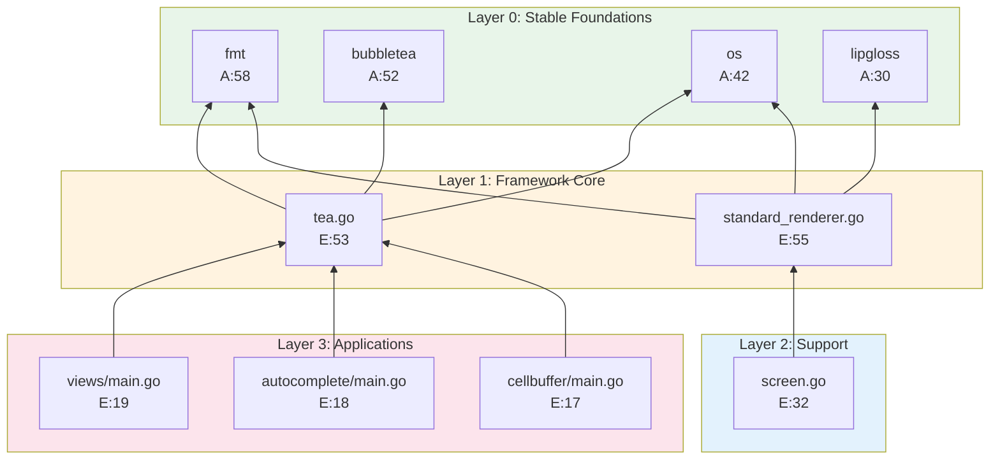

# Layered Graph Visualization Approach

Cleaner visualization through stratified layers, filtered nodes, and explicit edge semantics.

---

## Problem Statement

The raw dependency graph has:
- 505 objects (too many for single view)
- 769 morphisms (creates visual spaghetti)
- Mixed object types (files, imports, functions)
- No inherent visual hierarchy

**Goal**: Create a clean, layered visualization that reveals architectural structure.

---

## Stratification Strategy

### Layer Definition (Bottom-Up)

```
┌──────────────────────────────────────────────────────────────────────┐
│ LAYER 3: APPLICATIONS                                                │
│ examples/* (I = 1.0, isolated consumers)                             │
│ ~50 objects, 0 afferent coupling                                     │
├──────────────────────────────────────────────────────────────────────┤
│ LAYER 2: SUPPORTING MODULES                                          │
│ screen.go, key.go, options.go, logging.go                           │
│ ~10 objects, moderate coupling                                       │
├──────────────────────────────────────────────────────────────────────┤
│ LAYER 1: FRAMEWORK CORE                                              │
│ tea.go (E:53), standard_renderer.go (E:55)                           │
│ 2-3 objects, highest efferent coupling                               │
├──────────────────────────────────────────────────────────────────────┤
│ LAYER 0: STABLE FOUNDATIONS                                          │
│ fmt (A:58), os (A:42), bubbletea (A:52), lipgloss (A:30)            │
│ All imports, I = 0, highest afferent coupling                        │
└──────────────────────────────────────────────────────────────────────┘

DEPENDENCY DIRECTION: ↑ (upward only = DAG)
```

---

## Filtering Strategies

### Strategy A: "Executive Summary" (< 20 nodes)

Show only the most impactful components:

```
CRITERIA:
  - Imports with afferent_coupling >= 30
  - Files with efferent_coupling >= 25
  - At most 3 representative examples

RESULT SET:
  L0: fmt(58), bubbletea(52), os(42), lipgloss(30)
  L1: standard_renderer.go(E:55), tea.go(E:53)
  L2: screen.go(E:32)
  L3: views/main.go, autocomplete/main.go, cellbuffer/main.go
```

**ASCII Visualization**:
```
╔═══════════════════════════════════════════════════════════════════════╗
║                    BUBBLETEA: EXECUTIVE OVERVIEW                      ║
╠═══════════════════════════════════════════════════════════════════════╣
║                                                                       ║
║  LAYER 3: APPLICATIONS                                                ║
║  ┌──────────┐  ┌───────────────┐  ┌────────────┐                     ║
║  │ views    │  │ autocomplete  │  │ cellbuffer │                     ║
║  │ E:19     │  │ E:18          │  │ E:17       │                     ║
║  └────┬─────┘  └───────┬───────┘  └──────┬─────┘                     ║
║       │                │                  │                          ║
║       └────────────────┼──────────────────┘                          ║
║                        │                                              ║
║  ─────────────────────────────────────────────────────────────────   ║
║                                                                       ║
║  LAYER 2: SUPPORT                                                     ║
║            ┌───────────┐                                              ║
║            │ screen.go │                                              ║
║            │ E:32      │                                              ║
║            └─────┬─────┘                                              ║
║                  │                                                    ║
║  ─────────────────────────────────────────────────────────────────   ║
║                                                                       ║
║  LAYER 1: CORE                                                        ║
║  ┌─────────────────────┐    ┌──────────────────────────┐             ║
║  │ tea.go              │───→│ standard_renderer.go     │             ║
║  │ E:53 (Orchestrator) │    │ E:55 (Rendering Engine)  │             ║
║  └──────────┬──────────┘    └──────────┬───────────────┘             ║
║             │                           │                             ║
║  ─────────────────────────────────────────────────────────────────   ║
║                                                                       ║
║  LAYER 0: FOUNDATIONS (Stable Imports)                                ║
║  ┌───────┐  ┌───────────┐  ┌─────┐  ┌──────────┐                     ║
║  │  fmt  │  │ bubbletea │  │ os  │  │ lipgloss │                     ║
║  │ A:58  │  │ A:52      │  │A:42 │  │ A:30     │                     ║
║  └───────┘  └───────────┘  └─────┘  └──────────┘                     ║
║                                                                       ║
╚═══════════════════════════════════════════════════════════════════════╝

Legend: A = Afferent Coupling, E = Efferent Coupling
        → = Dependency Direction (from → to)
```

---

### Strategy B: "Framework Deep Dive" (< 40 nodes)

Exclude examples, show all framework internals:

```
CRITERIA:
  - All imports with afferent_coupling >= 5
  - All files NOT in examples/
  - Include function-level granularity for core files

LAYERS:
  L0: All standard library + external imports (15 nodes)
  L1: tea.go, standard_renderer.go + their key functions (8 nodes)
  L2: Supporting files (10 nodes)
```

---

### Strategy C: "Example Landscape" (< 60 nodes)

Focus on application diversity:

```
CRITERIA:
  - Only top 5 imports (as shared foundation)
  - Only tea.go + standard_renderer.go from core
  - All examples with efferent_coupling >= 8

PURPOSE: Show how applications use the framework
```

---

## Mermaid.js Implementation

### Executive Summary Graph



---

## Graph Generation Algorithm

### Python Pseudocode

```python
def generate_layered_graph(analysis_data, threshold='executive'):
    """Generate filtered layered graph from analysis.json"""

    # Define thresholds
    thresholds = {
        'executive': {'afferent': 30, 'efferent': 25, 'max_examples': 3},
        'framework': {'afferent': 5, 'efferent': 10, 'exclude_examples': True},
        'landscape': {'afferent': 40, 'efferent': 8, 'max_framework': 2}
    }
    t = thresholds[threshold]

    # Filter nodes
    nodes = []
    for obj_id, metrics in analysis_data['coupling_metrics'].items():
        include = False

        # Layer 0: Stable imports
        if obj_id.startswith('import:'):
            if metrics['afferent_coupling'] >= t['afferent']:
                include = True
                layer = 0

        # Layers 1-2: Framework files
        elif not obj_id.startswith('examples/'):
            if metrics['efferent_coupling'] >= t['efferent']:
                include = True
                layer = 1 if metrics['efferent_coupling'] >= 40 else 2

        # Layer 3: Examples
        elif obj_id.startswith('examples/'):
            if metrics['efferent_coupling'] >= t.get('min_example_efferent', 8):
                include = True
                layer = 3

        if include:
            nodes.append({
                'id': obj_id,
                'layer': layer,
                'afferent': metrics['afferent_coupling'],
                'efferent': metrics['efferent_coupling'],
                'instability': metrics['instability']
            })

    # Generate edges (simplified: layer N -> layer N-1)
    edges = []
    for node in nodes:
        if node['layer'] > 0:
            # Connect to nodes in lower layers with shared concerns
            for target in nodes:
                if target['layer'] == node['layer'] - 1:
                    # Heuristic: connect if target is high-afferent import
                    # or if target is the core orchestrator
                    if target['afferent'] > 20 or target['id'] in ['tea.go']:
                        edges.append({
                            'source': node['id'],
                            'target': target['id']
                        })

    return {'nodes': nodes, 'edges': edges}
```

---

## Radial Alternative Layout

For a different perspective, use radial layout with core at center:

```
                         ╭─────────────────────╮
                    ╭────│ autocomplete E:18   │────╮
               ╭────│    ╰─────────────────────╯    │────╮
          ╭────│    │                               │    │────╮
         ┌┴───────────────────────────────────────────────────┴┐
         │              examples/* (I=1.0)                     │
         │              APPLICATION RING                       │
         └────────────────────────┬────────────────────────────┘
                                  │
              ╭───────────────────┼───────────────────╮
              │                   │                   │
         ┌────┴────┐         ┌────┴────┐         ┌────┴────┐
         │screen.go│         │ key.go  │         │options  │
         │ E:32    │         │ E:18    │         │ E:21    │
         └────┬────┘         └────┬────┘         └────┬────┘
              │                   │                   │
              ╰───────────────────┼───────────────────╯
                                  │
                         ┌────────┴────────┐
                         │   tea.go (E:53) │
                         │  ┌───────────┐  │
                         │  │ renderer  │  │
                         │  │   (E:55)  │  │
                         │  └───────────┘  │
                         └────────┬────────┘
                                  │
                    ╭─────────────┴─────────────╮
                ╭───┴───╮   ╭────╮   ╭────╮   ╭───┴───╮
                │  fmt  │   │ os │   │time│   │lipglos│
                │ (A:58)│   │A:42│   │A:25│   │ (A:30)│
                ╰───────╯   ╰────╯   ╰────╯   ╰───────╯
```

---

## Edge Semantics

### Edge Types

| Type | Symbol | Description | Color (suggested) |
|------|--------|-------------|-------------------|
| Import | `─→` | File imports package | Blue |
| Calls | `═→` | Function calls function | Orange |
| Contains | `·→` | File contains function | Gray (often hidden) |
| Extends | `─▷` | Type extends interface | Green |

### Edge Weight Representation

Instead of showing all 769 morphisms, aggregate edge weights:

```
tea.go ══════════════════→ fmt
         (weight: 12 calls)

tea.go ─────→ time
         (weight: 3 calls)
```

**Width/thickness** proportional to coupling strength.

---

## Clean ASCII Generation Template

```python
def generate_clean_ascii(layers, width=72):
    """Generate clean ASCII diagram for terminal display"""

    output = []
    border = '═' * width

    output.append(f'╔{border}╗')
    output.append(f'║{"CATEGORICAL DEPENDENCY GRAPH":^{width}}║')
    output.append(f'╠{border}╣')

    for layer_num in sorted(layers.keys(), reverse=True):
        layer = layers[layer_num]
        output.append(f'║')
        output.append(f'║  LAYER {layer_num}: {layer["name"]:^{width-14}}║')

        # Render nodes in row
        nodes_str = '  '.join(
            f'[{n["id"][:12]} E:{n["efferent"]}]'
            for n in layer['nodes'][:5]
        )
        output.append(f'║  {nodes_str:<{width-4}}║')
        output.append(f'║')

        if layer_num > 0:
            # Draw connector
            output.append(f'║{"│":^{width}}║')
            output.append(f'║{"▼":^{width}}║')

    output.append(f'╚{border}╝')

    return '\n'.join(output)
```

---

## Summary

**Key Principles for Clean Layered Graphs**:

1. **Filter aggressively**: Show < 40 nodes for readability
2. **Stratify by instability**: Stable imports at bottom, unstable apps at top
3. **Aggregate edges**: Show weighted connections, not individual morphisms
4. **Use consistent semantics**: Color/shape for node types, width for edge weight
5. **Progressive disclosure**: Start with executive summary, drill down to details

---

## Next Steps

- `03-COUPLING-HEATMAPS.md`: Multi-dimensional coupling visualization
- `04-CATEGORICAL-FLOW.md`: Animated Elm architecture flow
